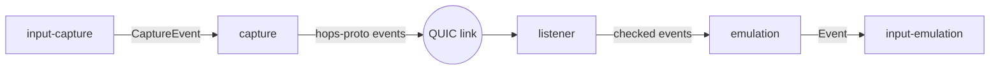

# How hops is put together

## Input path

- **input-capture** reads the local keyboard and pointer through the
  platform's backend (libei, layer-shell, macOS, Windows) and reports when
  the pointer reaches the edge of a device.
- **capture** (`src/capture.rs`) sends the input to the device the pointer
  crossed to, encoded by **hops-proto**, over that device's link.
- **listener** (`src/listen.rs`) accepts links, and admits each event only
  from a machine whose pairing lets it control this one and that has
  crossed onto this machine.
- **emulation** (`src/emulation.rs`) hands admitted events to
  **input-emulation**, which injects them through the platform's backend.

## Links

A link is one QUIC connection (quinn), authenticated with TLS 1.3 in both
directions: each machine presents its own certificate, and each checks the
other's fingerprint against its pairings during the handshake. There is no
second channel: input, the clipboard, pairing and removal notices all use
the link. The default port is UDP 4722.

The ALPN says which way control goes on a link:

- `grabbr-hop/1`: the machine that dialled controls the one it reached.
- `grabbr-hop/1-driven`: the machine that dialled is controlled by the one
  it reached. A machine behind a VPN or security client that drops
  unsolicited inbound connections is controlled this way, with
  `listen = false` (`src/dial_back.rs`).

Which machine dials is decided by the pairing, not by the address. The
ports and directions are listed in [docs/NETWORK.md](docs/NETWORK.md).

## Crossing

A machine is in one of two states towards a device: sending to it, or
receiving from it, never both at once, so input cannot loop back.

1. When the pointer reaches a device's edge, capture sends `Enter` and
   waits for `Ack` over the same link.
2. Until the pointer comes back, local input goes to that device and not
   to this machine.
3. When the pointer comes back, capture sends `Leave`. If the link drops
   instead, the receiving machine releases the keys and buttons it was
   holding down for the other machine.

After the handshake each side sends `Hello` (its build) and `Capability`
(the optional protocol features it supports), and `Ping`/`Pong` tells the
sender whether the receiver can inject input.

## Frontends

The daemon (`hops daemon`, `src/service.rs`) owns capture, emulation, the
links and the trust store. The GUI (`hops-slint`), the terminal UI
(`hops-tui`) and the CLI (`hops-cli`) reach it over a local channel
(`hops-ipc`): a Unix socket, or a named pipe on Windows, where every
connection must prove it holds the token beside `config.toml`.
