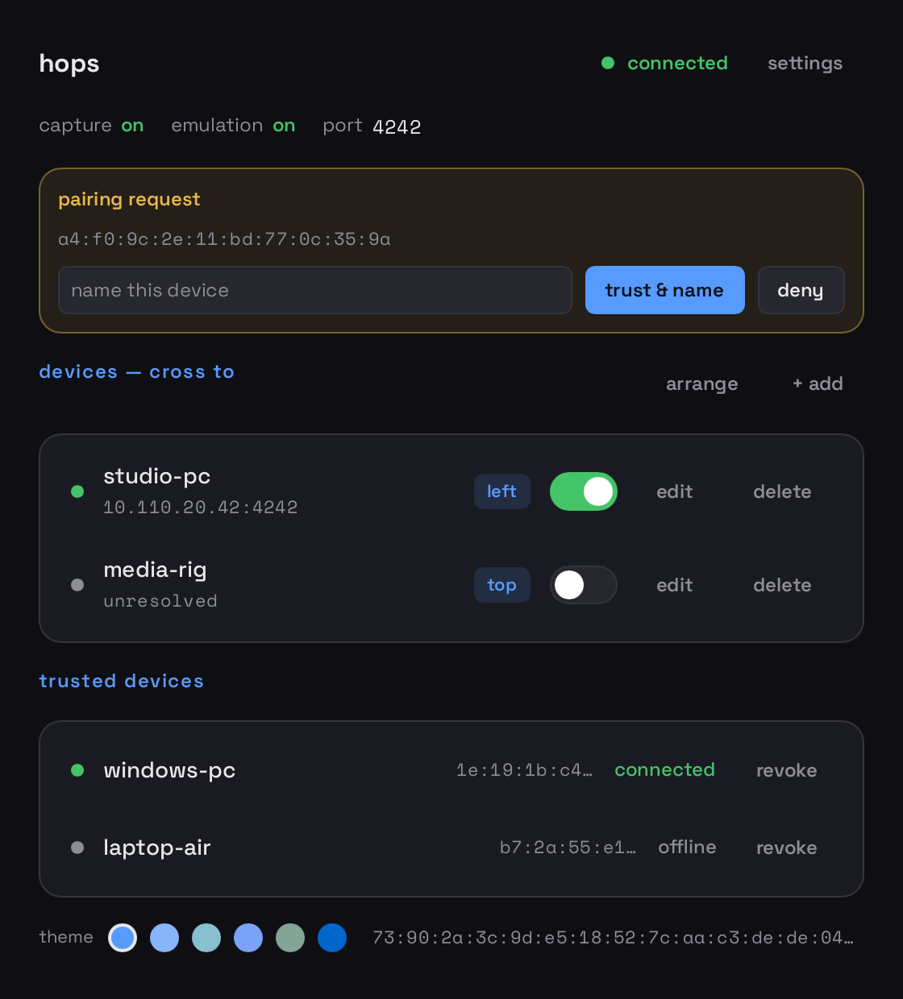
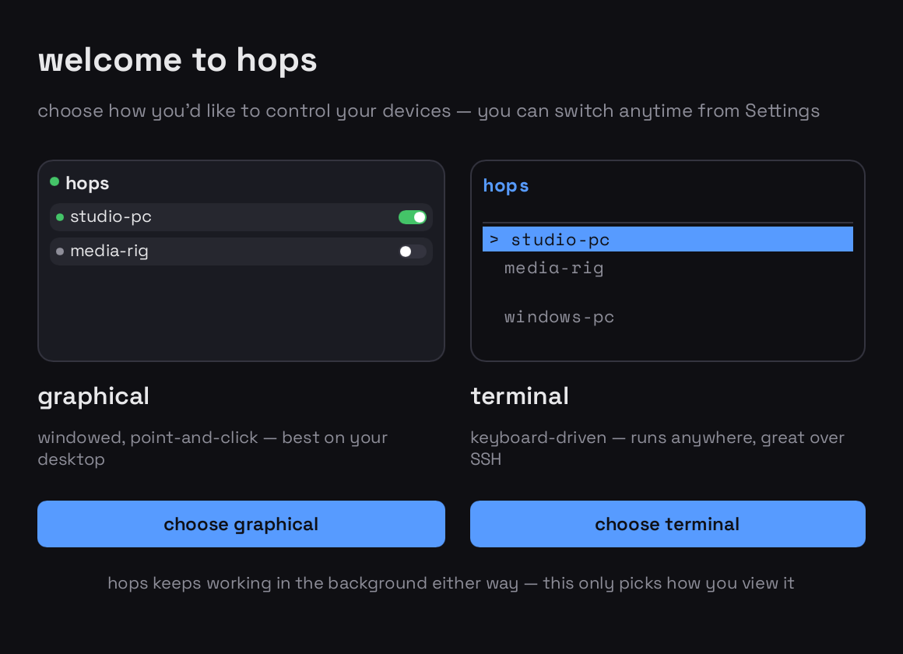

# hops

**Share one keyboard and mouse across your Mac, Windows, and Linux machines** —
a software KVM. Move your cursor to the edge of the screen and it *hops* to the
next computer, keyboard and all. No hardware, no cloud; the machines talk
directly to each other over your LAN.

part of the **grabbr** suite · repo: **grabbr-hops** · a fork of
[lan-mouse](https://github.com/feschber/lan-mouse) · GPLv3

<p align="center">
  
</p>

## Why hops

- **Truly cross-platform** — macOS, Windows, and Linux, one app, one binary
  (`hops`).
- **Encrypted, direct connections** — traffic runs over **QUIC + TLS 1.3**
  (quinn + rustls). Peers are pinned by public-key fingerprint, so only machines
  you've explicitly paired can connect (see [Security](#security)).
- **Explicit pairing** — a new machine shows up as a pairing request with its
  fingerprint; you name it and approve it once, and the trust persists.
- **Three ways to drive it** — a native **GUI**, a **terminal UI** for SSH /
  keyboard-driven use, and a **system-tray** icon; all attach to the same
  background daemon.
- **Runs headless** — install just the daemon on a server and control it over
  SSH (see [service/README.md](service/README.md)).
- **Themeable** — a built-in palette set plus your own themes dropped in as TOML.

## Interfaces

| | |
| --- | --- |
| **GUI** | `hops gui` — the windowed control panel (above). Native tray icon; starts hidden in the menu bar / notification area with `--hidden`. |
| **TUI** | `hops tui` — the same control panel in your terminal; ideal over SSH. |
| **Daemon** | `hops daemon` — the background receiver/sender the front-ends attach to. |
| **CLI** | `hops cli` — scripted, one-shot configuration. |

Running `hops` with no arguments picks up where you left off — on the first run
it asks how you'd like to drive it:

<p align="center">
  
</p>

## Quick start

Install [Rust](https://rustup.rs) once (`curl --proto '=https' --tlsv1.2 -sSf https://sh.rustup.rs | sh`).

Then, **on each machine** you want to share the keyboard & mouse across:

```sh
git clone https://github.com/jtjones09/grabbr-hops
cd grabbr-hops
./install.sh                 # macOS / Linux
```
On **Windows**, run the installer with PowerShell instead:
```powershell
powershell -ExecutionPolicy Bypass -File .\install.ps1
```

That builds hops and starts it in your **menu bar / system tray**, set to launch
at login. Two per-OS things to allow:

- **macOS** opens the Accessibility settings — switch **hops** on (it can't move
  your cursor without it).
- **Windows** — if the firewall asks, allow hops on your **private** network.

> **Just want to try it, no install?** Build and run the binary directly:
> ```sh
> cargo build --release --no-default-features --features "tui slint"
> ./target/release/hops           # hops.exe on Windows
> ```

## Connect two machines

1. Both machines are running hops now.
2. On one, open the window (click the tray icon) → **+ add** the other machine:
   its IP address and which screen edge it sits on (left/right/top/bottom).
3. The first connection shows a **pairing request** with a fingerprint — name it
   and hit **trust & name**. Just once per pair.
4. Move your cursor off that edge — it hops over. Keyboard, scroll, and modifier
   keys follow.

## Other ways to run it

- **Terminal UI** (keyboard-driven, great over SSH): `hops tui`.
- **Headless / servers** (no GUI, controlled over the network): build with
  `--no-default-features` and use the service units + guide in
  [service/README.md](service/README.md).
- **Linux backends / advanced:** input capture & emulation backends are cargo
  features (`layer_shell_capture`, `x11_capture`, `libei_*`, …) — see `Cargo.toml`.

## Security

- **Transport:** all traffic is **QUIC** (quinn) secured with **TLS 1.3**
  (rustls + ring). Nothing is sent in the clear.
- **Identity:** each machine holds a self-signed keypair; peers are verified by
  the **fingerprint of the public key**, not by a CA. rustls' certificate check
  is delegated to fingerprint pinning, so a machine is trusted only after you
  approve its fingerprint (trust on first use, with explicit consent).
- **No cloud, no accounts:** machines connect directly over your LAN. There is no
  relay and no telemetry.

Trust, config, and the keypair live in `~/.config/lan-mouse/` (Linux/macOS) or
`%LOCALAPPDATA%\lan-mouse\` (Windows).

> Note: this is a hobby-scale project, not an audited security product. Run it on
> networks you trust.

## Credits & license

hops is a fork of **[lan-mouse](https://github.com/feschber/lan-mouse)** by Felix
Eschberger (`feschber`) and its contributors — full attribution and the list of
what this fork changes are in [NOTICE.md](NOTICE.md). All original copyright is
preserved in the git history.

Licensed under the **GNU General Public License v3.0 or later** — see
[LICENSE](LICENSE).
